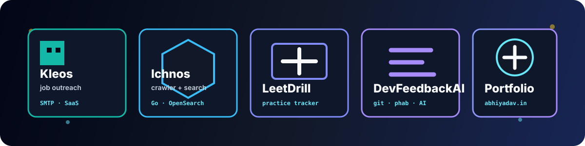

<h1 align="center">Abhinav Yadav</h1>

  <a href="https://abhiyadav.in">Portfolio</a> ·
  <a href="https://abhiyadav.in/resume">Resume</a> ·
  <a href="https://abhiyadav.in/linkedin">LinkedIn</a> ·
  <a href="https://github.com/abhinav-yadav-official">GitHub</a>

  

## Resume Snapshot

I build production-minded tools with clear user workflows, boring deployment paths, and polished public surfaces. My recent projects sit around search infrastructure, recruiter/job outreach, developer productivity, and AI-assisted feedback.

| Area | Recent work |
|---|---|
| Search and crawling | Built **Ichnos**, a Go crawler and full-text search stack with Redis frontier, OpenSearch indexing, Prometheus metrics, and an htmx UI. |
| Product tooling | Built **Kleos**, a privacy-first job outreach SaaS using own-inbox SMTP sending, encrypted credentials, resume upload, and email drafting. |
| Developer workflows | Built **DevFeedbackAI**, a provider-based CLI that turns Phabricator or git activity into quarterly developer feedback. |
| Personal platform | Built and maintain **abhiyadav.in**, a static animated portfolio with project pages, SEO metadata, resume routing, and deployment automation. |

## Public Projects

| Project | Stack | What it is | Links |
|---|---|---|---|
| **Kleos** | Go, PostgreSQL, SMTP, Docker | Privacy-first job outreach from your own email sender. | [Repo](https://github.com/abhinav-yadav-official/Kleos) · [Live](https://abhiyadav.in/kleos/) |
| **Ichnos** | Go, Redis, OpenSearch, htmx | Domain-specific web crawler and search engine. | [Repo](https://github.com/abhinav-yadav-official/Ichnos) · [Live](https://abhiyadav.in/ichnos/) |
| **LeetDrill** | Self-hosted web app | LeetCode practice tracker for drilling consistently. | [Repo](https://github.com/abhinav-yadav-official/LeetDrill) · [Live](https://abhiyadav.in/leetdrill/) |
| **DevFeedbackAI** | Python, git, Phabricator, Claude CLI | Quarterly developer feedback from engineering activity. | [Repo](https://github.com/abhinav-yadav-official/DevFeedbackAI) |
| **Portifolio** | HTML, CSS, JavaScript, Three.js | Animated personal site and resume hub. | [Repo](https://github.com/abhinav-yadav-official/Portifolio) · [Live](https://abhiyadav.in/) |

## Toolbox

  
  
  
  
  
  
  

## Operating Style

- Ship small, complete tools with a clear runtime contract.
- Prefer explicit systems over framework-heavy abstractions.
- Keep public projects usable: docs, screenshots, live URLs, deploy notes, and examples.
- Use AI where it removes busywork, while keeping the source data and output constraints visible.

## Activity

  
  

## Links

- Portfolio: [abhiyadav.in](https://abhiyadav.in)
- Resume: [abhiyadav.in/resume](https://abhiyadav.in/resume)
- LinkedIn: [abhiyadav.in/linkedin](https://abhiyadav.in/linkedin)
