  

## What I Build

I like small, useful systems that do one job clearly: crawl and search a domain, manage focused job outreach, track coding practice, and turn engineering activity into readable feedback.

## Public Projects

| Project | What it does | Live |
|---|---|---|
| [Kleos](https://github.com/abhinav-yadav-official/Kleos) | Privacy-first job outreach from your own email sender. | [abhiyadav.in/kleos](https://abhiyadav.in/kleos/) |
| [Ichnos](https://github.com/abhinav-yadav-official/Ichnos) | Domain-specific crawler and full-text search engine in Go. | [abhiyadav.in/ichnos](https://abhiyadav.in/ichnos/) |
| [LeetDrill](https://github.com/abhinav-yadav-official/LeetDrill) | Self-hosted LeetCode practice tracker. | [abhiyadav.in/leetdrill](https://abhiyadav.in/leetdrill/) |
| [DevFeedbackAI](https://github.com/abhinav-yadav-official/DevFeedbackAI) | Quarterly developer feedback from Phabricator or git activity. | - |
| [Portifolio](https://github.com/abhinav-yadav-official/Portifolio) | Animated static personal website. | [abhiyadav.in](https://abhiyadav.in/) |

## Current Stack

## Links

[Website](https://abhiyadav.in) · [Projects](https://abhiyadav.in/#projects)
